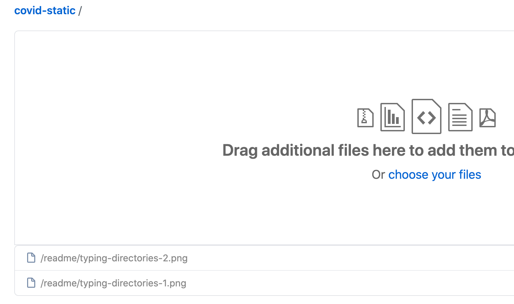
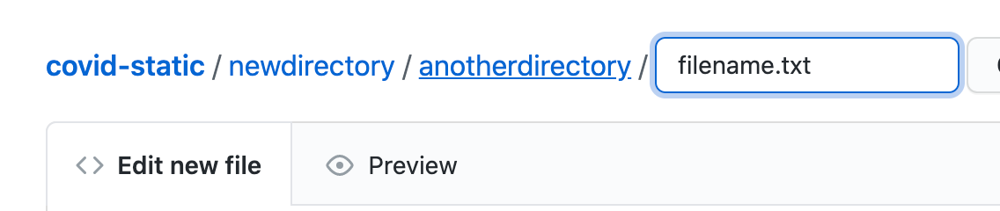

# covid-static

## NOTE: As of 5-28-2024 This project is not actively maintained by ODI and this repo is being converted to Archive (read-only) status.

This handles the binary files for the covid19.ca.gov site. Files placed in this repository will be deployed to Azure blob storage backed CDN with a low cache timer on files with .pdf extension. This will allow content authors to get new or modified pdfs to production quickly.

We pointed a friendly subdomain at this new CDN: https://files.covid19.ca.gov/ so file paths in this directory are browseable there. 

There is a redirect in place on the covid19.ca.gov server so that /pdf/ requests will get redirected to the new domain files.covid19.ca.gov from the new CDN. We should still update urls to use the new domain directly when we encounter them.

## Uploading files

### Creating subdirectories

- Entire folders can be dragged into the github browser based file manager and github will create the files inside the subdirectory sent



- You can type directory names into the filename field and when you type a / at the end it will add them to the path and give you another field to name the file itself




## PDF File naming

### Dynamically linking translated files

We often have English and translated versions of images or pdfs that are used in the WordPress posts. We send these to AvantPage for human translation and they only translate the visible HTML, leaving the urls the same. In order to get the translated file to dynamically appear when it exists use the following file naming convention:

Your filename should end with: ```--en.pdf``` or ```--en.png```

If you name a file like that when the site is built (which happens anytime content is updated) the page build code creating any non english page will look for a corresponding file location on files.covid19.ca.gov like ```--es.pdf```. If that file is found the appropriate translated file version will be used. If not found the English url will remain.

So if you have a file named: ```myfile--en.pdf``` and you upload it in the pdf directory with another file named ```myfile--ar.pdf``` when the Arabic page containing that url is built the Arabic url will be used.

### Data

Our data sources power our covid19.ca.gov charts and tracker boxes. [Data sources](./data/README.md).

## Deploys

git action builds deploy on any file change, the list of files changed in the last commit are deployed. This is different than other git actions where we do a full checkout and deploy everything. We don't do that here because these are big files and it takes longer to check them all out and move them all each time.

### Disabling

You can disable deploys temporarily by turning off the git action by selecting it in the actions page of the github web interface and choosing disable workflow from the kebab menu on the right.

If you have disabled it and commits are occuring you will need to rerun those commits to get those file changes deployed after you re-enable the workflow

A good way to do that in a foolproof manner is to first revert any change that occurred during disabled deploys, then revert the revert. You can cancel the git action workflow triggerred during the initial revert if you want without negative effects but it is unnecessary to do that because deploys from this repo do not delete files in the Azure blob storage target

## File persistence

Deleting a file in this repo will not remove it from the Azure blob storage. That needs to be done manually in Azure if you want to totally remove a file from production url

There is a 1 minute cache on the CDN in front of files.covid19.ca.gov
